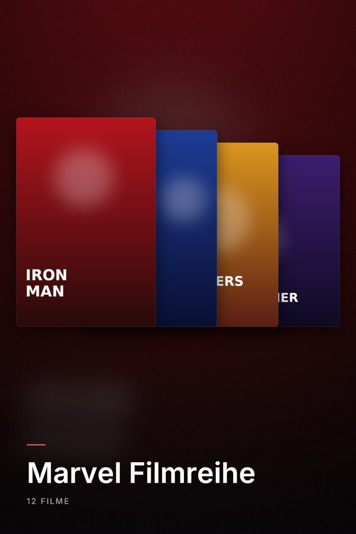
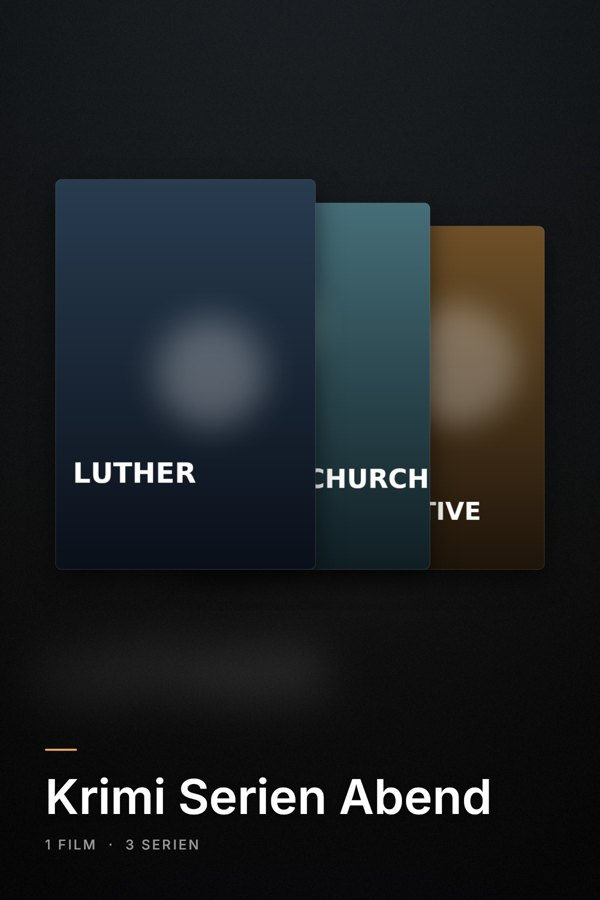
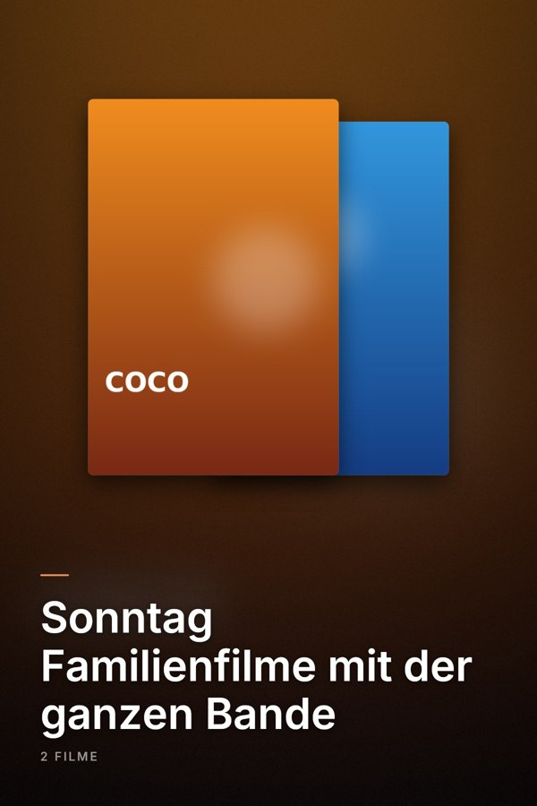

# Jellyfin Playlist Covers

Plugin für den Jellyfin-Server, das für **Film- und Serien-Playlists** hochwertige Cover erzeugt – statt der
zusammengewürfelten Standard-Collage. Es läuft direkt im Server, ohne externes Tool.

<p>
  
  
  
</p>

> Die Beispiele oben sind mit Platzhalter-Postern gerendert. Im Betrieb verwendet das Plugin die echten Poster
> der Titel aus deiner Bibliothek.

## Funktionen

- **Poster-Layout (2:3, Standard):** Die Poster der Titel als gestaffelter Stapel, der erste Titel der Playlist liegt vorne.
  Darunter der Playlist-Name und die Anzahl der Filme und Serien. Hintergrund aus dem ersten Poster, abgedunkelt, mit dezenter Akzentfarbe.
- **Querformat-Layout (16:9, optional):** Überblendete Backdrops, Name und bis zu drei Titel-Logos in der Bildmitte.
- Bei Serien, Staffeln und Episoden wird das Poster der **Serie** verwendet.
- Läuft als **geplante Aufgabe** (beim Serverstart und täglich um 04:00) und lässt sich jederzeit von Hand starten.
  Es werden nur Playlists neu gerendert, deren Inhalt sich geändert hat – oder deren Cover von etwas anderem überschrieben wurde.
- **Ausschlussmuster** für Playlists, die ihr eigenes Cover behalten sollen.
- Eingebettete Schrift (Inter), keine Abhängigkeit von Systemschriften.

## Voraussetzungen

- Jellyfin **12.1** oder neuer
- Playlists mit Filmen und/oder Serien, die Poster haben (Metadaten-Anbieter wie TMDb)

## Installation (Plugin-Katalog)

1. Jellyfin-Dashboard → **Plugins** → **Repositories** → **+**
2. Eintragen:
   - **Name:** `Playlist Covers`
   - **URL:** `https://github.com/jpokorny312/Jellyfin-Playlist-Cover-Generator/releases/latest/download/manifest.json`
3. Speichern, dann unter **Plugins → Katalog** nach **Playlist Covers** suchen und installieren.
4. Jellyfin neu starten.
5. Dashboard → **Geplante Aufgaben** → **Playlist-Cover erzeugen** → ▶ starten.

Updates erscheinen danach ganz normal im Katalog.

### Manuelle Installation

ZIP aus dem [neuesten Release](https://github.com/jpokorny312/Jellyfin-Playlist-Cover-Generator/releases/latest)
nach `<Jellyfin-Datenordner>/plugins/PlaylistCovers/` entpacken und Jellyfin neu starten.

## Einstellungen

Dashboard → **Plugins** → **Playlist Covers**

| Einstellung | Bedeutung |
|---|---|
| Format | **Poster (2:3)** oder **Querformat (16:9)**. Nach einem Wechsel werden alle Cover beim nächsten Lauf neu erzeugt. |
| Playlists ausschließen | Eine pro Zeile, `*` und `?` sind erlaubt (z. B. `Handgemacht*`). Diese Playlists behalten ihr Cover. |
| Schriftart | Optional: Pfad zu einer `.ttf`/`.otf` auf dem Server. Leer = eingebettete Schrift (Inter). |
| Titel in Großbuchstaben | Nur im Querformat. |

## Hinweise

- Das Plugin ersetzt das **Primärbild** der Playlist. Cover, die du von Hand gesetzt hast, werden überschrieben –
  nimm solche Playlists in die Ausschlussliste auf.
- Jellyfin erzeugt für Playlists selbst eine Collage. Sollte sie das Plugin-Cover nach einer Metadaten-Aktualisierung
  ersetzen, erkennt das Plugin das beim nächsten Lauf und rendert neu.
- Clients zeigen Poster meist im Format 2:3. Das Querformat wird je nach Client zugeschnitten; Name und Logos liegen
  deshalb in der quadratischen Mitte.

## Entwicklung

Voraussetzung: .NET-10-SDK.

```bash
./build.sh [version]                                # baut dist/playlist-covers_<version>.zip
dotnet run --project Demo -c Release -- demo_out    # rendert Beispiel-Cover ohne Server
```

Projektaufbau:

- `Jellyfin.Plugin.PlaylistCovers/` – das Plugin (`CoverRenderer*.cs` = Rendering mit SkiaSharp, `PlaylistCoverService.cs` = Anbindung an Jellyfin)
- `Demo/` – Konsolenprogramm, das Beispiel-Cover aus erfundenen Bildern rendert
- `scripts/update_manifest.py` – pflegt das Plugin-Repository-Manifest

### Release veröffentlichen

```bash
git tag v0.2.0 && git push origin v0.2.0
```

Der Workflow `.github/workflows/release.yml` baut das Plugin, legt ein GitHub-Release mit ZIP und `manifest.json` an
und hängt die neue Version an das bisherige Manifest an, sodass ältere Versionen installierbar bleiben.
Das Repository-Manifest ist immer unter `releases/latest/download/manifest.json` erreichbar.

## Lizenzen

Die eingebettete Schrift **Inter** steht unter der SIL Open Font License 1.1
(siehe `Jellyfin.Plugin.PlaylistCovers/Fonts/OFL-Inter.txt`).
